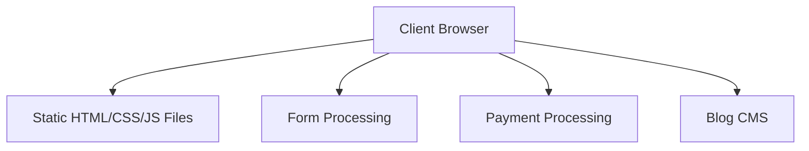
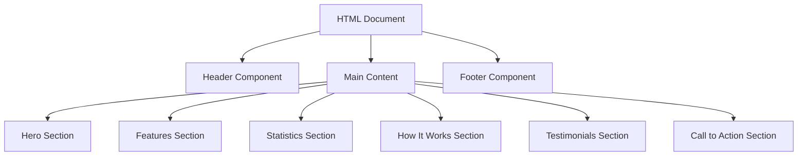

# MindPattern - System Patterns

## System Architecture

The MindPattern marketing website follows a static site architecture with client-side interactivity. This approach was chosen for its simplicity, performance, and ease of deployment while still allowing for rich interactive elements.

### Architecture Overview



### Key Components

1. **Static HTML Pages**: Core website content delivered as pre-built HTML files
2. **CSS Styling System**: Modular CSS with design system principles
3. **JavaScript Modules**: Client-side functionality for animations and interactivity
4. **Form Handling**: For contact, signup, and newsletter subscriptions
5. **Payment Integration**: For processing subscriptions and donations
6. **Blog System**: For managing and displaying PhD-level mental health content

## Key Technical Decisions

### Static Site Approach
- **Decision**: Use static HTML/CSS/JS rather than a dynamic CMS or JavaScript framework
- **Rationale**: Maximizes performance, simplifies hosting, and reduces security concerns while meeting all requirements
- **Trade-offs**: Less dynamic content capability, but sufficient for a marketing site

### CSS Architecture
- **Decision**: Implement a custom design system with utility classes
- **Rationale**: Provides consistency across the site while allowing for component-specific styling
- **Implementation**: Separate CSS files for design system, component styles, and fixes

### JavaScript Organization
- **Decision**: Modular JavaScript files organized by functionality
- **Rationale**: Improves maintainability and allows for selective loading
- **Implementation**: Separate files for animations, main functionality, and fixes

### Animation Strategy
- **Decision**: Use CSS animations with JavaScript triggers
- **Rationale**: Better performance than pure JavaScript animations while maintaining control
- **Implementation**: Animation classes applied based on scroll position and user interaction

## Design Patterns in Use

### Component-Based Design
The website uses a component-based approach to HTML/CSS structure, with reusable elements like cards, buttons, and sections that maintain consistent styling and behavior.

### Reveal on Scroll
Elements become visible or animate as they enter the viewport, implemented using the 'reveal' class and JavaScript scroll detection.

```javascript
// Conceptual implementation
document.addEventListener('scroll', function() {
  const revealElements = document.querySelectorAll('.reveal');
  revealElements.forEach(element => {
    if (isInViewport(element)) {
      element.classList.add('active');
    }
  });
});
```

### Interactive Cards
Card elements respond to user interaction with hover effects and subtle animations, enhancing engagement.

### Magnetic Buttons
Primary call-to-action buttons use a "magnetic" effect that subtly moves the button toward the cursor when nearby, increasing click-through rates.

### Progressive Disclosure
Information is presented in a hierarchical manner, with the most important details visible immediately and additional information available through user interaction.

## Component Relationships

### Page Structure Hierarchy



### Component Inheritance

The website uses a consistent inheritance pattern for styling:

1. Base styles from design-system.css
2. Component-specific styles from styles.css
3. Overrides and fixes from fixes.css

This layered approach allows for both consistency and customization.

### Responsive Behavior

Components are designed with a mobile-first approach, using CSS media queries to adapt to different screen sizes:

```css
/* Conceptual implementation */
.component {
  /* Mobile styles (default) */
  width: 100%;
}

@media (min-width: 768px) {
  .component {
    /* Tablet styles */
    width: 50%;
  }
}

@media (min-width: 1024px) {
  .component {
    /* Desktop styles */
    width: 33.33%;
  }
}
```

## Technical Debt and Considerations

### Current Technical Debt
- Duplicate CSS and JavaScript includes in some HTML files
- Some hardcoded content that could be externalized for easier updates
- Image path handling that requires a separate CSS file

### Optimization Opportunities
- Implement a build process to minify and bundle CSS/JS
- Add lazy loading for images and non-critical resources
- Improve accessibility features for screen readers and keyboard navigation
- Implement structured data for better SEO
